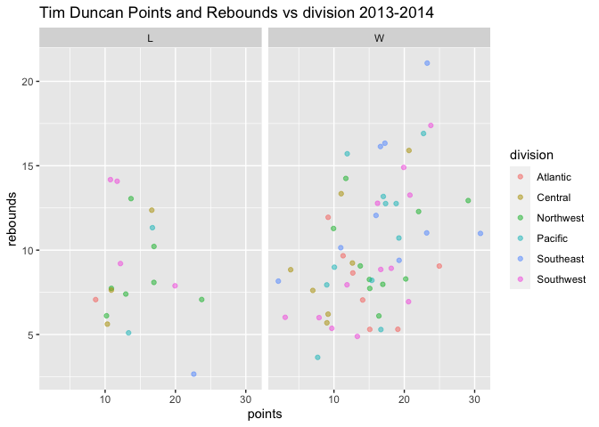
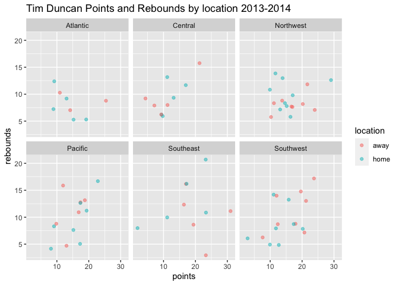

Project 2
================
brian higginbotham
2023-10-06

- [1 Summary](#1-summary)
- [2 Required Packages](#2-required-packages)
- [3 Query API](#3-query-api)
- [4 EDA](#4-eda)

# 1 Summary

This project encompasses querying data from an API and manipulating the
results to produce some insightful EDA’s.

I chose the basketball API [Free
NBA](https://rapidapi.com/theapiguy/api/free-nba) from
[rapidapi](https://rapidapi.com) because I thought it would be
interesting to compare player and team information in a way that gave
the user more control than traditional basketball reference websites. As
we will see, this did provide some interesting and frustrating results.

# 2 Required Packages

Here is a list of the packages that were used in this project.

``` r
library(httr)
library(tidyverse)
library(dplyr)
library(tidyr)
library(jsonlite)
library(ggplot2)
library(gganimate)
library(gifski)
library(png)
```

# 3 Query API

My plan for the API query was to create a call that would allow the user
to pull player and game data. For the player data, I would allow the
user to select a specific player and season to collect data on or they
could collect data on a player’s entire career. For the game data, I
wanted to allow the user to select the team, season, and specify whether
they wanted regular or postseason data.

The endpoints of the API:  
+ `Players` - contains player name, id, physical info (height, weight,
etc), drafted team name  
+ `Teams` - contains team name, id, city, team abbreviation, team full
name  
+ `Games` - date of game, game id, team ids (home & visitor), scores
(home & visitor), season, postseason  
+ `Stats` - essentially the box score for each player on every game
they’ve played (points, rebounds, etc)

There were a few obstacles to creating the API query that should be
mentioned here since a large part of constructing the functions was to
get around them.

The first issue is that the Free NBA API appears to be designed for
websites or apps and NOT for data mining. Results from the API query
come back “paged” with only the first page being pulled. This makes
sense if one is pulling the data in through a website or app and can
click on “page 2” to pull the next page of data. But for my purposes, a
loop needed to be written to collect each page of data at a time.

The second issue was that the parameter options provided by the API were
not very helpful. Specific players or teams could be searched for if one
had the `player_id` or `team_id` - both of which were numeric keys that
had no immediate reference.

## 3.1 Player Stats

The first step to creating the `player_stats()` query was to write a
small function that could take in the player’s name and return the
`player_id` to be used in the `Stats` endpoint.

``` r
player_id <- function(last_name, first_name = ""){
  
  url <- "https://free-nba.p.rapidapi.com/players"
  
  queryString <- list(
    page = "0",
    per_page = "25",
    search = paste(first_name, last_name)
  )
  
  response <- VERB("GET", url, query = queryString, add_headers('X-RapidAPI-Key' = '3009c8c91amsh65cad163db7085ap15d3d2jsnad2333f55e76', 'X-RapidAPI-Host' = 'free-nba.p.rapidapi.com'), content_type("application/octet-stream"))
  
  id <- fromJSON(rawToChar(response$content))$data[1]
  attributes(id)$names[1] <- "player_id"
  
  return(id)
}
```

<br> Next, in order to loop through all the “pages” and collect the
data, I’ll need to know how many pages are associated with the queried
player. Additionally, the API query will have the option of collecting
data from one particular season or for a whole career, so the length of
the data can vary considerably. Therefore, I set up a function to
determine the total number of pages that would be returned based on the
input parameters. This function is designed for a specific `year`
parameter:

``` r
# The final function will have year default to "career" if it is left empty. For this piece, year will have a numeric value (2010, 2015, 2023, etc)
page_num <- function(last_name, first_name = "", year = "career"){
# This is the previous function that identifies the player_id
  id <- player_id(last_name, first_name)
  
  url <- paste0("https://free-nba.p.rapidapi.com/stats?seasons[]=", year, "&player_ids[]=", id)
  
  queryString <- list(
    page = "0",
    per_page = "25"
  )
  
  response <- VERB("GET", url, add_headers('X-RapidAPI-Key' = '3009c8c91amsh65cad163db7085ap15d3d2jsnad2333f55e76', 'X-RapidAPI-Host' = 'free-nba.p.rapidapi.com'), content_type("application/octet-stream"))
  
  n <- fromJSON(rawToChar(response$content))$meta$total_pages[[1]]
  return(n)
}
```

The input parameters for this function will be the same as the input
parameters of the final function. In fact, this function returns the
first “page” of our query, but since we don’t know initially how many
total pages the query is, we have to run this function first to get `n`,
the total number of pages we need to loop through.

If no year is specified in the query parameter, then the query will
default to career stats. Since the URL in the above function is set up
for “?seasons\[\]= year”, I’ll need to modify it slightly in order to
get the total number of pages for the player’s career stats.

``` r
page_num_career <- function(last_name, first_name = ""){
  id <- player_id(last_name, first_name)
# I've removed the season parameter from the URL
  url <- paste0("https://free-nba.p.rapidapi.com/stats?player_ids[]=", id)
  
  queryString <- list(
    page = "0",
    per_page = "25"
  )
  
  response <- VERB("GET", url, add_headers('X-RapidAPI-Key' = '3009c8c91amsh65cad163db7085ap15d3d2jsnad2333f55e76', 'X-RapidAPI-Host' = 'free-nba.p.rapidapi.com'), content_type("application/octet-stream"))
  
  n <- fromJSON(rawToChar(response$content))$meta$total_pages[[1]]
  return(n)
}
```

<br> Now I’m ready to construct the query that will return the player’s
stats by year. As I mentioned above, it is very similar to the function
that the returns the number of pages. The main difference is in that
function I accessed the `$meta` component in the `response$content`, but
now I will access the `$data` component.

Let’s take a look at the `player_stats_year()` function

``` r
player_stats_year <- function(last_name, first_name = "", year){
  id <- player_id(last_name, first_name)
  n <- page_num(last_name, first_name, year)
  stats <- data.frame()
  
  for(i in 1:n){
    url <- paste0("https://free-nba.p.rapidapi.com/stats?seasons[]=", year, "&player_ids[]=", id)
    
    queryString <- list(
      page = i,
      per_page = "25"
    )
    
    response <- VERB("GET", url, query = queryString, add_headers('X-RapidAPI-Key' = '3009c8c91amsh65cad163db7085ap15d3d2jsnad2333f55e76', 'X-RapidAPI-Host' = 'free-nba.p.rapidapi.com'), content_type("application/octet-stream"))
    
    temp <- fromJSON(rawToChar(response$content))$data
    attributes(temp$team)$names[1] <- "teamid"
    temp <- bind_cols(temp %>% select(-team), temp$team)
    attributes(temp$game)$names[1] <- "gameid"
    temp <- bind_cols(temp %>% select(-game), temp$game)
    attributes(temp$player)$names[1] <- "playerid"
    temp <- bind_cols(temp %>% select(-player), temp$player)
    
    temp <- temp %>% select("first_name", "last_name", "abbreviation", "date", "season", "home_team_id", "home_team_score", "visitor_team_id", "visitor_team_score", "ast", "blk", "min", "pf", "pts", "reb", "stl")
    stats <- rbind(stats, temp)
  }
  stats <- stats %>% mutate(min=substr(stats$min, 1, 2))
  stats$min <- as.numeric(stats$min)
  attributes(stats)$names[3] <- "team"
  
  return(stats)
}
```

After the `player_id()` and `page_num()` functions, I’ve initiated the
empty dataframe `stats`. This is where I’ll collect my pages of data
from the `for loop`. Next is the `for loop` in which I’ll iterate the
API call 1:n times, with each time being a successive page number. This
is reflected in the `queryString` as page = i.

After I collected the `response`, things got a little tricky. Initially,
the `for loop` did not work because each successive page had the same
index (1:25) and so it was throwing an error about rows already
existing. So I decided the best way around this was to go ahead and
select the relevant columns before it executed `rbind()`. However, this
led to another issue - the returned `$data` data frame had subsetted
data frames. Essentially, all the relevant Player, Team, and Game
information from the API call were subsetted data frames. So in order to
bring those subsetted data frames up to a column level that can be
`selected()`, I used `bind_cols()`.

Before executing `bind_cols()`, I had to rename the `id` column for each
subsetted dataframe. Without this step, the function would return
“rename notifications” regarding the `id` columns for each `bind_cols`
on every page of the `for loop`.Essentially, the returned dataframe as
well as the subsetted dataframes each have their own `id` column
(`temp$id`, `game$id`, `team$id`, `player$id`). When `bind_cols()` is
called, it pulls the subsetted dataframe columns up to the “primary”
dataframe. In doing so, it drops the subsetted dataframe name and
“attaches” the column name to the “primary” dataframe. So the `temp`
dataframe then has multiple columns named `id`. R would automatically
rename these columns (`id...1`, `id...18`, etc,) based on their position
in the dataframe. In doing so, it would return a notification in the
console. For some function calls, it would return 180 -200
notifications.

It would be worth noting that the functions did work even with the
“rename notifications”. But since they were part of the return, I
thought it would be a good idea to figure out a way to prevent it. I’m
not sure if this was the best way to go about it, but it did work.

Finally, there were two different ways the `min` data was recorded - as
an integer and in ms format (mm:ss). After some unsuccessful trials with
`lubridate()` to get these two different formats uniform, I decided the
seconds portion of the `min` variable was kind of unnecessary. So I
removed the seconds portion and converted the entire column to numeric
so it could be aggregated.

I have a very similar function for the Player Stats by Career query.
Exactly like the `page_num_career()` function, it simply has a modified
URL.

``` r
player_stats_career <- function(last_name, first_name = ""){
  id <- player_id(last_name, first_name)
  n <- page_num_career(last_name, first_name)
  stats <- data.frame()
  
  for(i in 1:n){
    url <- paste0("https://free-nba.p.rapidapi.com/stats?player_ids[]=", id)
    
    queryString <- list(
      page = i,
      per_page = "25"
    )
    
    response <- VERB("GET", url, query = queryString, add_headers('X-RapidAPI-Key' = '3009c8c91amsh65cad163db7085ap15d3d2jsnad2333f55e76', 'X-RapidAPI-Host' = 'free-nba.p.rapidapi.com'), content_type("application/octet-stream"))
    
    temp <- fromJSON(rawToChar(response$content))$data
    attributes(temp$team)$names[1] <- "teamid"
    temp <- bind_cols(temp %>% select(-team), temp$team)
    attributes(temp$game)$names[1] <- "gameid"
    temp <- bind_cols(temp %>% select(-game), temp$game)
    attributes(temp$player)$names[1] <- "playerid"
    temp <- bind_cols(temp %>% select(-player), temp$player)
    
    temp <- temp %>% select("first_name", "last_name", "abbreviation", "date", "season", "home_team_id", "home_team_score", "visitor_team_id", "visitor_team_score", "ast", "blk", "min", "pf", "pts", "reb", "stl")
    stats <- rbind(stats, temp)
  }
  stats <- stats %>% mutate(min=substr(stats$min, 1, 2))
  stats$min <- as.numeric(stats$min)
  attributes(stats)$names[3] <- "team"
  
  return(stats)
}
```

<br> Finally, we can put it all together in one wrapper function that
will determine which function to use and return the appropriate query
results:

``` r
player_stats <- function(last_name, first_name = "", year = 'career'){
  if(year == "career"){
    return(player_stats_career(last_name, first_name))
  } else {
    return(player_stats_year(last_name, first_name, year))
  }
}
```

<br> \## Team Stats

The team stats info resides in the `Games` API endpoint, so the first
step is to create a function that will retrieve the `team_id` based on
the team name entered.

``` r
get_team_id <- function(team){

url <- "https://free-nba.p.rapidapi.com/teams"

queryString <- list(page = "0")

response <- VERB("GET", url, query = queryString, add_headers('X-RapidAPI-Key' = '3009c8c91amsh65cad163db7085ap15d3d2jsnad2333f55e76', 'X-RapidAPI-Host' = 'free-nba.p.rapidapi.com'), content_type("application/octet-stream"))

parsed <- fromJSON(rawToChar(response$content))$data

filter <- parsed %>% filter(name == team)
return(filter$id)
}
```

The Team endpoint of the API only returns 28 rows - one for each NBA
team. So I wrote this funciton to simply retrieve all 28 teams and then
match the entered parameter (`team`) to the team name (`name`) and
return the `team_id`.

I also needed to get the total number of pages produced by the query
parameters to be able to use a `for loop`. This function is almost
identical to that used for the same purpose with `player_stats()`.

``` r
page_num_team <- function(team, season, postseason){
  id <- get_team_id(team)
  
  url <- paste0("https://free-nba.p.rapidapi.com/games?seasons[]=", year, "&team_ids[]=", id, "&postseason=", postseason)
  
  queryString <- list(
    page = "0",
    per_page = "25"
  )
  
  response <- VERB("GET", url, add_headers('X-RapidAPI-Key' = '3009c8c91amsh65cad163db7085ap15d3d2jsnad2333f55e76', 'X-RapidAPI-Host' = 'free-nba.p.rapidapi.com'), content_type("application/octet-stream"))
  
  n <- fromJSON(rawToChar(response$content))$meta$total_pages[[1]]
  return(n)
}
```

<br> The `team_stats()` function is similar to the `player_stats()`
except I’ll be querying the `Games` endpoint. The function requires a
team name, season, and an optional postseason logical argument. The
postseason default argument is set to `FALSE`, so if the user omits the
argument, the query will return regular season data only. Team name and
season are required arguments to speed up the query return time. It
would be possible, if the user wanted, to pull data from every NBA game
for every season, but I thought for the purposes of this assignment that
the results would be too large.

``` r
team_stats <- function(team, season, postseason = FALSE){
  id <- get_team_id(team)
  n <- page_num_team(team, season, postseason)
  team_stats <- data.frame()
  
  for(i in 1:n){
    url <- paste0("https://free-nba.p.rapidapi.com/games?seasons[]=", season, "&team_ids[]=", id, "&postseason=", postseason)
    
    queryString <- list(
      page = i,
      per_page = "25"
    )
    
    response <- VERB("GET", url, query = queryString, add_headers('X-RapidAPI-Key' = '3009c8c91amsh65cad163db7085ap15d3d2jsnad2333f55e76', 'X-RapidAPI-Host' = 'free-nba.p.rapidapi.com'), content_type("application/octet-stream"))
    
    temp <- fromJSON(rawToChar(response$content))$data
    attributes(temp$home_team)$names[1] <- "hometeamid"
    temp <- bind_cols(temp %>% select(-home_team), temp$home_team)
    attributes(temp)$names[12:17] <- c("home_team_id", "home_team_city", "home_team_conf", "home_team_div", "home_team", "home_team_name")
    attributes(temp$visitor_team)$names[1] <- "visitorteamid"
    temp <- bind_cols(temp %>% select(-visitor_team), temp$visitor_team)
    attributes(temp)$names[18:23] <- c("visitor_team_id", "visitor_team_city", "visitor_team_conf", "visitor_team_div", "visitor_team", "visitor_team_name")
    
    temp <- temp %>% select("date", "postseason", "season", "home_team_id", "home_team_city", "home_team_conf", "home_team_div", "home_team_name", "home_team_score", "visitor_team_id", "visitor_team_city", "visitor_team_conf", "visitor_team_div", "visitor_team_name", "visitor_team_score")
    
    team_stats <- rbind(team_stats, temp)
  }

  return(team_stats)
}
```

The `for loop` and `bind_cols()` work exactly the same as they did in
`player_stats()`. <br>

# 4 EDA

As a longtime San Antonio Spurs fan, one my favorite seasons to remember
was the 2013-2014 season. The prior season had seen the Spurs return to
the Finals against the Miami Heat only to lose what would have been
their Finals clinching game with less than 20 seconds on the clock.
Crestfallen at the loss, they would go on to lose the succeeding game
seven. Many thought it was the end of the Tim Duncan era. But in the
following 2013-2014 season, the Spurs would go on to have one of the
most dominating regular and postseason runs, culminating in a repeat of
the previous year’s finals and defeating the Miami Heat and the all-star
starting trio of Lebron James, Dwayne Wade, and Chris Bosch in five
games.

First off, let’s see what the Spurs regular season win/loss record was
for that year. And then let’s see if their record varied at all
depending on if they played at home. We’ll also want to see how they
matched up against different divisions.

Let’s pull in the Spurs 2013 game stats and inspect the structure.

``` r
spurs_2013_r <- team_stats("Spurs", 2013)
str(spurs_2013_r)
```

    ## 'data.frame':    82 obs. of  15 variables:
    ##  $ date              : chr  "2014-04-08T00:00:00.000Z" "2013-11-15T00:00:00.000Z" "2013-11-30T00:00:00.000Z" "2013-11-05T00:00:00.000Z" ...
    ##  $ postseason        : logi  FALSE FALSE FALSE FALSE FALSE FALSE ...
    ##  $ season            : int  2013 2013 2013 2013 2013 2013 2013 2013 2013 2013 ...
    ##  $ home_team_id      : chr  "MIN" "UTA" "SAS" "DEN" ...
    ##  $ home_team_city    : chr  "Minnesota" "Utah" "San Antonio" "Denver" ...
    ##  $ home_team_conf    : chr  "West" "West" "West" "West" ...
    ##  $ home_team_div     : chr  "Northwest" "Northwest" "Southwest" "Northwest" ...
    ##  $ home_team_name    : chr  "Timberwolves" "Jazz" "Spurs" "Nuggets" ...
    ##  $ home_team_score   : int  110 82 106 94 85 86 91 102 84 126 ...
    ##  $ visitor_team_id   : chr  "SAS" "SAS" "HOU" "SAS" ...
    ##  $ visitor_team_city : chr  "San Antonio" "San Antonio" "Houston" "San Antonio" ...
    ##  $ visitor_team_conf : chr  "West" "West" "West" "West" ...
    ##  $ visitor_team_div  : chr  "Southwest" "Southwest" "Southwest" "Southwest" ...
    ##  $ visitor_team_name : chr  "Spurs" "Spurs" "Rockets" "Spurs" ...
    ##  $ visitor_team_score: int  91 91 112 102 109 102 109 100 100 96 ...

Looking at the structure, we can see that there is no Win/Loss variable
so we’ll need to create that first. To do so, I’ll create a `W_L` column
and run `if_else()` to determine if the column should be populated with
a `W` or `L`. I’ll use logical operators to determine if the Spurs won
or lost.

``` r
spurs_2013_r <- spurs_2013_r %>%
  mutate(W_L = if_else(home_team_id == "SAS" & home_team_score > visitor_team_score, "W", 
                       if_else(visitor_team_id == "SAS" & visitor_team_score > home_team_score, "W", "L")))
```

Now I’ll run a very simple contingency table to get the season win/loss
record.

``` r
table(spurs_2013_r$W_L)
```

    ## 
    ##  L  W 
    ## 20 62

The Spurs won 75% of all their regular season games - that’s a great
season!

Now let’s see how they played against the different divisions. Recall
that the structure of the API output does have home and visitor team
information, including confernce and division. The problem with this
structure is that the Spurs were both home and visiting team throughout
the season. So I’ll need to manipulate the data in a way that will
isolate the Spurs as either the home or visiting team and relabel the
opposing teams as `opponent`. I did this by splitting the `spurs_2013_r`
object in two - one in which the Spurs occupy only the `home_team`
column and another in which the Spurs only occupy the `visitor_team`
column. From there, I can rename the columns appropriately and then
recombine the objects back into a single dataframe using `rbind()`.

``` r
spurs_2013_home <- spurs_2013_r %>% filter(visitor_team_id != "SAS") %>% mutate(location = "home")%>% select(date, visitor_team_id, visitor_team_conf, visitor_team_div, visitor_team_score, home_team_id, home_team_score, W_L, location) %>% rename(opponent = visitor_team_id, opponent_conf = visitor_team_conf, opponent_div = visitor_team_div, opponent_score = visitor_team_score, SA = home_team_id, spurs_score = home_team_score)

spurs_2013_away <- spurs_2013_r %>% filter(home_team_id != "SAS") %>% mutate(location = "away")%>% select(date, home_team_id, home_team_conf, home_team_div, home_team_score, visitor_team_id, visitor_team_score, W_L, location) %>% rename(opponent = home_team_id, opponent_conf = home_team_conf, opponent_div = home_team_div, opponent_score = home_team_score, SA = visitor_team_id, spurs_score = visitor_team_score)

spurs_2013_regular <- rbind(spurs_2013_home, spurs_2013_away)
```

I also added another categorical variable, `location` that will be
useful for analysis. Now let’s see how the Spurs record looks when split
across different variables.

``` r
table(spurs_2013_regular$W_L, spurs_2013_regular$opponent_div)
```

    ##    
    ##     Atlantic Central Northwest Pacific Southeast Southwest
    ##   L        2       3         7       3         1         4
    ##   W        8       7        11      15         9        12

The highest winning percentage by division is the Southeast - that’s
Miami’s division.

``` r
table(spurs_2013_regular$W_L, spurs_2013_regular$opponent)
```

    ##    
    ##     ATL BKN BOS CHA CHI CLE DAL DEN DET GSW HOU IND LAC LAL MEM MIA MIL MIN NOP NYK OKC ORL PHI PHX POR SAC
    ##   L   0   1   0   0   1   0   0   0   1   0   4   1   1   1   0   1   0   1   0   1   4   0   0   1   2   0
    ##   W   2   1   2   2   1   2   4   3   1   4   0   1   2   3   4   1   2   2   4   1   0   2   2   3   2   3
    ##    
    ##     TOR UTA WAS
    ##   L   0   0   0
    ##   W   2   4   2

But it looks like the Spurs split their regular season games with the
Heat.

``` r
table(spurs_2013_regular$W_L, spurs_2013_regular$opponent_div, spurs_2013_regular$location)
```

    ## , ,  = away
    ## 
    ##    
    ##     Atlantic Central Northwest Pacific Southeast Southwest
    ##   L        1       1         4       2         1         2
    ##   W        4       4         5       7         4         6
    ## 
    ## , ,  = home
    ## 
    ##    
    ##     Atlantic Central Northwest Pacific Southeast Southwest
    ##   L        1       2         3       1         0         2
    ##   W        4       3         6       8         5         6

And it looks like they lost that Heat game in Miami. So home court
advantage in the playoffs might be important.

Now let’s take a look at the Spurs W/L record in relation to how many
points they scored.

``` r
g <- ggplot(spurs_2013_regular, aes(x=spurs_score, fill = W_L))
g + geom_histogram(position = "dodge", binwidth=1) +
  labs(x = "Spurs Score", y = "Frequency", title = "Final Regular Season Scores by Win/Loss 2013-2014", fill = "W/L")
```

<!-- --> <br> It looks
like if the Spurs score over 100 pts in a game, they will be pretty hard
to beat.

Now let’s take a look at how the Spurs perennial All-Star, Tim Duncan,
performed during this season and see if there is any connection between
his performance and the team’s W/L record.

Let’s first pull in Tim Duncan’s data for the 2013-2014 season.

``` r
timmy <- player_stats("duncan", "tim", 2013)
str(timmy)
```

    ## 'data.frame':    100 obs. of  16 variables:
    ##  $ first_name        : chr  "Tim" "Tim" "Tim" "Tim" ...
    ##  $ last_name         : chr  "Duncan" "Duncan" "Duncan" "Duncan" ...
    ##  $ team              : chr  "SAS" "SAS" "SAS" "SAS" ...
    ##  $ date              : chr  "2013-10-30T00:00:00.000Z" "2013-11-02T00:00:00.000Z" "2013-11-05T00:00:00.000Z" "2013-11-06T00:00:00.000Z" ...
    ##  $ season            : int  2013 2013 2013 2013 2013 2013 2013 2013 2013 2013 ...
    ##  $ home_team_id      : int  27 25 8 27 27 20 23 27 27 29 ...
    ##  $ home_team_score   : int  101 115 94 99 76 89 85 92 106 82 ...
    ##  $ visitor_team_id   : int  15 27 27 24 10 27 27 30 11 27 ...
    ##  $ visitor_team_score: int  94 105 102 96 74 120 109 79 112 91 ...
    ##  $ ast               : int  2 1 8 5 5 2 NA 3 3 2 ...
    ##  $ blk               : int  0 1 4 1 2 1 NA 2 3 3 ...
    ##  $ min               : num  17 31 34 28 32 24 NA 26 32 34 ...
    ##  $ pf                : int  2 3 4 1 2 1 NA 0 2 0 ...
    ##  $ pts               : int  3 24 17 17 8 11 NA 2 20 14 ...
    ##  $ reb               : int  6 7 8 5 4 10 NA 8 8 9 ...
    ##  $ stl               : int  0 0 0 0 1 0 NA 0 1 0 ...

<br> Inspect the `str()` to make sure the correct data was pulled.

Now we’ll want to join Tim’s record to the Spurs regular season record.
We can do this by merging on the `date` column since the date in both
dataframes is the date both the Spurs and Tim played.

``` r
timmy_2013_team <- merge(timmy, spurs_2013_regular, by = "date")
str(timmy_2013_team)
```

    ## 'data.frame':    77 obs. of  24 variables:
    ##  $ date              : chr  "2013-10-30T00:00:00.000Z" "2013-11-02T00:00:00.000Z" "2013-11-05T00:00:00.000Z" "2013-11-06T00:00:00.000Z" ...
    ##  $ first_name        : chr  "Tim" "Tim" "Tim" "Tim" ...
    ##  $ last_name         : chr  "Duncan" "Duncan" "Duncan" "Duncan" ...
    ##  $ team              : chr  "SAS" "SAS" "SAS" "SAS" ...
    ##  $ season            : int  2013 2013 2013 2013 2013 2013 2013 2013 2013 2013 ...
    ##  $ home_team_id      : int  27 25 8 27 27 20 23 27 29 27 ...
    ##  $ home_team_score   : int  101 115 94 99 76 89 85 92 82 104 ...
    ##  $ visitor_team_id   : int  15 27 27 24 10 27 27 30 27 2 ...
    ##  $ visitor_team_score: int  94 105 102 96 74 120 109 79 91 93 ...
    ##  $ ast               : int  2 1 8 5 5 2 NA 3 2 3 ...
    ##  $ blk               : int  0 1 4 1 2 1 NA 2 3 0 ...
    ##  $ min               : num  17 31 34 28 32 24 NA 26 34 28 ...
    ##  $ pf                : int  2 3 4 1 2 1 NA 0 0 2 ...
    ##  $ pts               : int  3 24 17 17 8 11 NA 2 14 13 ...
    ##  $ reb               : int  6 7 8 5 4 10 NA 8 9 9 ...
    ##  $ stl               : int  0 0 0 0 1 0 NA 0 0 0 ...
    ##  $ opponent          : chr  "MEM" "POR" "DEN" "PHX" ...
    ##  $ opponent_conf     : chr  "West" "West" "West" "West" ...
    ##  $ opponent_div      : chr  "Southwest" "Northwest" "Northwest" "Pacific" ...
    ##  $ opponent_score    : int  94 115 94 96 74 89 85 79 82 93 ...
    ##  $ SA                : chr  "SAS" "SAS" "SAS" "SAS" ...
    ##  $ spurs_score       : int  101 105 102 99 76 120 109 92 91 104 ...
    ##  $ W_L               : chr  "W" "L" "W" "W" ...
    ##  $ location          : chr  "home" "away" "away" "home" ...

<br> Again, we’ll inspect the `str()` to make sure the data looks
correct. Now we have a table with both Tim’s individual stats and the
game data.

Let’s see if Tim Duncan’s point totals for games relates to the Spurs
W/L record.

``` r
g <- ggplot(timmy_2013_team, aes(x = W_L, y = pts))
g + geom_boxplot(fill = 'grey') +
  labs(x = "Win/Loss", y = "points", title = "Tim Duncan Points by Win/Loss 2013-2014")
```

<!-- --> <br> It does look
like Tim is averaging over 15 points per game for Wins and less than 15
points per game for losses.

It should be noted that Tim Duncan is more than just a scorer. As a
power forward he can have a dominating defensive presence in the paint,
a stat that can be reflected in rebounds. So let’s take a look at Tim’s
points and rebounds totals across his opponents divisions and the Spurs
W/L record.

``` r
g <- ggplot(timmy_2013_team, aes(x = pts, y = reb))
g + geom_point(aes(colour = opponent_div), alpha = 0.5, position = "jitter") +
  labs(x = "points", y = "rebounds", title = "Tim Duncan Points and Rebounds vs division 2013-2014") + guides(color = guide_legend(title = "division")) + facet_wrap(~ W_L)
```

<!-- --> <br> Looks
like Tim had a really poor rebounding effort in a loss against a
Southeast team. If you’ll recall, the Spurs went 9-1 against the
Southeast, losing only to Miami. So it appears that Tim would need to be
a more defensive presence on the court if the Spurs are to get past
Miami.

Let’s see if Tim’s performance is affected in way by the location of the
game.

``` r
g <- ggplot(timmy_2013_team, aes(x = pts, y = reb))
g + geom_point(aes(colour = location), alpha = 0.5, position = "jitter") +
  labs(x = "points", y = "rebounds", title = "Tim Duncan Points and Rebounds by location 2013-2014") + guides(color = guide_legend(title = "location")) + facet_wrap(~ opponent_div)
```

<!-- --> <br> Except for
one game, it appears Tim was not at his best at away games in the
Central division.

Finally, as a long time Tim Duncan fan, I’d like to take a look at his
averages in points and rebounds and see how they have changed through
his career. So let’s pull Tim’s career stats, find the mean of his
points and rebounds by season, and animate them in a point plot.

``` r
timmy_career_ <- player_stats("duncan", "tim")
timmy_career <- timmy_career_ %>% drop_na(pts, reb) %>% group_by(season) %>% summarize(points = mean(pts), rebounds = mean(reb))

ggplot(timmy_career, aes(points, rebounds)) +
  geom_point(alpha = 0.7, show.legend = FALSE) +
  labs(title = "Season: {frame_time}", x = "points", y = "rebounds") +
  transition_time(season) +
  ease_aes("linear")
```

    ## Rendering [=====>--------------------------------------------------------------------] at 39 fps ~ eta:  2sRendering [======>-------------------------------------------------------------------] at 38 fps ~ eta:  2sRendering [=======>------------------------------------------------------------------] at 38 fps ~ eta:  2sRendering [========>-----------------------------------------------------------------] at 38 fps ~ eta:  2sRendering [=========>----------------------------------------------------------------] at 38 fps ~ eta:  2sRendering [==========>---------------------------------------------------------------] at 38 fps ~ eta:  2sRendering [===========>--------------------------------------------------------------] at 38 fps ~ eta:  2sRendering [============>-------------------------------------------------------------] at 38 fps ~ eta:  2sRendering [=============>------------------------------------------------------------] at 38 fps ~ eta:  2sRendering [==============>-----------------------------------------------------------] at 38 fps ~ eta:  2sRendering [===============>----------------------------------------------------------] at 38 fps ~ eta:  2sRendering [================>---------------------------------------------------------] at 38 fps ~ eta:  2sRendering [=================>--------------------------------------------------------] at 38 fps ~ eta:  2sRendering [==================>-------------------------------------------------------] at 37 fps ~ eta:  2sRendering [===================>------------------------------------------------------] at 37 fps ~ eta:  2sRendering [====================>-----------------------------------------------------] at 37 fps ~ eta:  2sRendering [=====================>----------------------------------------------------] at 37 fps ~ eta:  2sRendering [======================>---------------------------------------------------] at 37 fps ~ eta:  2sRendering [=======================>--------------------------------------------------] at 37 fps ~ eta:  2sRendering [========================>-------------------------------------------------] at 37 fps ~ eta:  2sRendering [=========================>------------------------------------------------] at 37 fps ~ eta:  2sRendering [==========================>-----------------------------------------------] at 37 fps ~ eta:  2sRendering [===========================>----------------------------------------------] at 37 fps ~ eta:  2sRendering [============================>---------------------------------------------] at 37 fps ~ eta:  2sRendering [=============================>--------------------------------------------] at 37 fps ~ eta:  2sRendering [==============================>-------------------------------------------] at 37 fps ~ eta:  2sRendering [===============================>------------------------------------------] at 37 fps ~ eta:  2sRendering [================================>-----------------------------------------] at 37 fps ~ eta:  1sRendering [=================================>----------------------------------------] at 37 fps ~ eta:  1sRendering [==================================>---------------------------------------] at 37 fps ~ eta:  1sRendering [===================================>--------------------------------------] at 37 fps ~ eta:  1sRendering [====================================>-------------------------------------] at 37 fps ~ eta:  1sRendering [=====================================>------------------------------------] at 37 fps ~ eta:  1sRendering [======================================>-----------------------------------] at 37 fps ~ eta:  1sRendering [=======================================>----------------------------------] at 37 fps ~ eta:  1sRendering [========================================>---------------------------------] at 37 fps ~ eta:  1sRendering [=========================================>--------------------------------] at 37 fps ~ eta:  1sRendering [==========================================>-------------------------------] at 37 fps ~ eta:  1sRendering [===========================================>------------------------------] at 37 fps ~ eta:  1sRendering [============================================>-----------------------------] at 37 fps ~ eta:  1sRendering [=============================================>----------------------------] at 37 fps ~ eta:  1sRendering [==============================================>---------------------------] at 37 fps ~ eta:  1sRendering [===============================================>--------------------------] at 37 fps ~ eta:  1sRendering [================================================>-------------------------] at 37 fps ~ eta:  1sRendering [=================================================>------------------------] at 37 fps ~ eta:  1sRendering [==================================================>-----------------------] at 37 fps ~ eta:  1sRendering [===================================================>----------------------] at 37 fps ~ eta:  1sRendering [====================================================>---------------------] at 37 fps ~ eta:  1sRendering [=====================================================>--------------------] at 37 fps ~ eta:  1sRendering [======================================================>-------------------] at 37 fps ~ eta:  1sRendering [=======================================================>------------------] at 37 fps ~ eta:  1sRendering [========================================================>-----------------] at 37 fps ~ eta:  1sRendering [=========================================================>----------------] at 37 fps ~ eta:  1sRendering [==========================================================>---------------] at 37 fps ~ eta:  1sRendering [===========================================================>--------------] at 37 fps ~ eta:  1sRendering [============================================================>-------------] at 37 fps ~ eta:  0sRendering [=============================================================>------------] at 37 fps ~ eta:  0sRendering [==============================================================>-----------] at 37 fps ~ eta:  0sRendering [===============================================================>----------] at 37 fps ~ eta:  0sRendering [================================================================>---------] at 37 fps ~ eta:  0sRendering [=================================================================>--------] at 37 fps ~ eta:  0sRendering [==================================================================>-------] at 37 fps ~ eta:  0sRendering [===================================================================>------] at 37 fps ~ eta:  0sRendering [====================================================================>-----] at 37 fps ~ eta:  0sRendering [=====================================================================>----] at 37 fps ~ eta:  0sRendering [======================================================================>---] at 37 fps ~ eta:  0sRendering [=======================================================================>--] at 37 fps ~ eta:  0sRendering [========================================================================>-] at 37 fps ~ eta:  0sRendering [==========================================================================] at 37 fps ~ eta:  0s                                                                                                           

<!-- --> <br> Note that
Tim’s career spans 18 years and that for the majority of those years,
his points and rebounds exceed 15pt/10reb. Consistency of excellence!
Tim Duncan 5-EVA! (’cuz 4-eva is too short)
